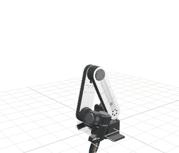

# Structis S1

Software and simulation assets for the **Structis S1** leader–follower kit:
the **S1A** follower arm (6 axes + gripper, 4 kg payload, 700 mm reach, wrist
camera) and the **S1L** leader arm for teleoperation.

Hardware: [structis.ai/hardware](https://structis.ai/hardware.html) · Built in Hamburg.

[](https://structisai.github.io/S1/viewer/)

**[▶ Drag the arm](https://structisai.github.io/S1/viewer/)** — interactive URDF viewer, joints and limits from `s1_description`.

```
S1/
├── s1_description/     URDF (right + left arm), visual + collision meshes, camera and tool0 frames
├── lerobot_s1/         LeRobot plugin `lerobot_robot_s1`: S1A follower, S1L leader, Damiao CAN driver, calibration
├── docs/               quick start, assembly instructions, wiring, verification checklist
└── tools/              build_meshes.py — mesh pipeline used to build s1_description
```

## Quick start

Requires LeRobot ≥ 0.4.3 (plugin discovery). The pip name and the import name are the
same on purpose: `lerobot_robot_s1`.

```bash
pip install lerobot_robot_s1

# Linux: bring up the CAN-USB adapter (1 Mbit/s)
sudo ip link set can0 up type can bitrate 1000000 && sudo ip link set can0 txqueuelen 256

lerobot-find-port                # S1L (USB serial)
lerobot-find-cameras opencv      # wrist camera index

lerobot-calibrate --robot.type=s1_follower --robot.id=s1a_right --robot.cameras='{}'
lerobot-calibrate --teleop.type=s1_leader  --teleop.id=s1l_right --teleop.port=/dev/ttyUSB0

lerobot-teleoperate \
  --robot.type=s1_follower --robot.id=s1a_right \
  --robot.cameras='{"wrist": {"type": "opencv", "index_or_path": 0, "width": 640, "height": 480, "fps": 30}}' \
  --teleop.type=s1_leader --teleop.id=s1l_right --teleop.port=/dev/ttyUSB0 --fps=30

lerobot-record ... --dataset.repo_id=<user>/s1_pick_place --dataset.single_task="..." \
  --dataset.num_episodes=20 --dataset.push_to_hub=false
lerobot-train --policy.type=act ...          # ACT, Diffusion, π0, GR00T
```

Bimanual: two follower/leader pairs, ids `s1a_left` / `s1a_right` — see
`lerobot_s1/examples/bimanual_teleop.py`. Full command reference and safety notes in
`lerobot_s1/README.md`.

## Simulation

`s1_description/urdf/s1_right.urdf` and `s1_left.urdf` load in MuJoCo (URDF
importer), PyBullet, Isaac, yourdfpy, trimesh — and in the browser:
[structisai.github.io/S1/viewer](https://structisai.github.io/S1/viewer/)
(`docs/viewer/index.html`, three.js + urdf-loader, no build step). Joint order matches the plugin:
`base, link1, link2, link3, link4, link5, gripper`. See `s1_description/README.md`.

## Status

**Beta.** The plugin is tested against mocked hardware; verification on the first Batch 01 arms is in progress (see `docs/VERIFY_ON_HARDWARE.md`). Batch 01 hardware ships with this software. Kinematics are CAD-derived and
validated against recorded teleop episodes; inertials are CAD estimates.
Issues and questions: open an issue or roberto@structis.ai.

## Licence

Apache 2.0 (see `LICENSE`). Structis and S1 are trademarks of Structis UG
(haftungsbeschränkt). The visual meshes are simulation-grade decimations, not
manufacturing geometry.
